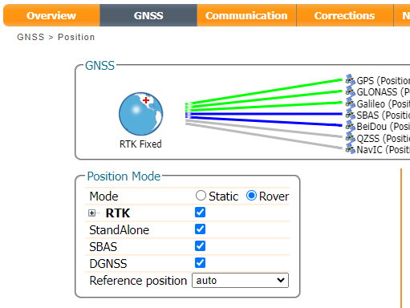
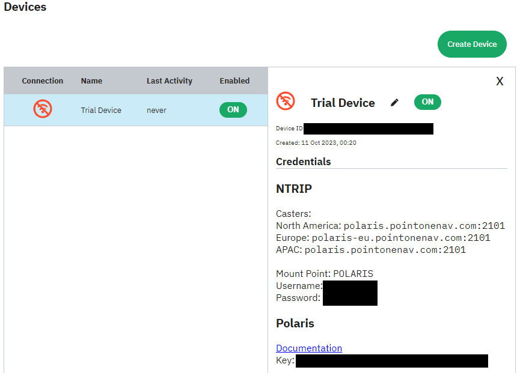
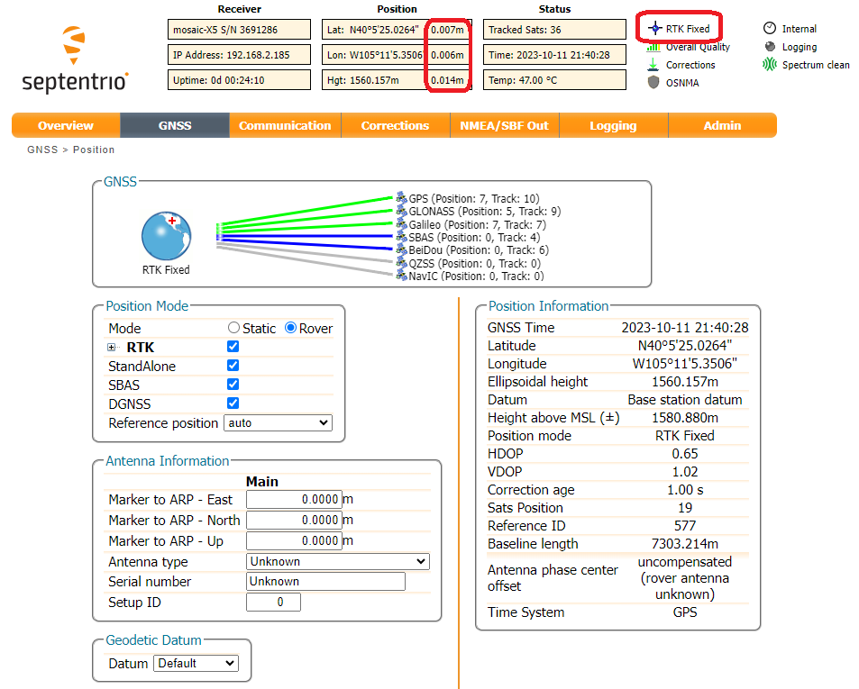
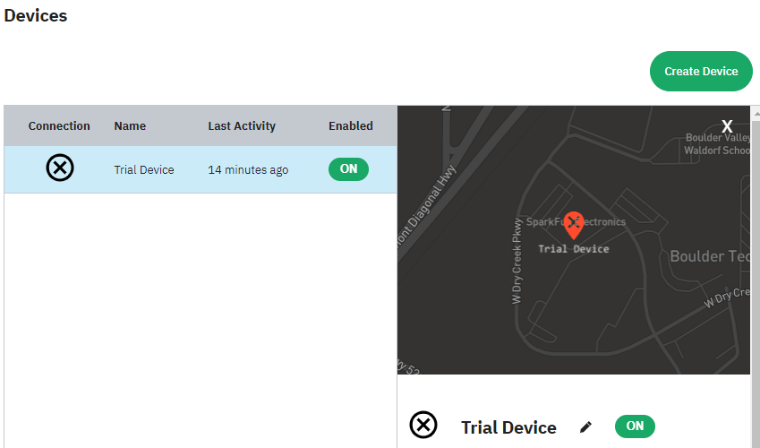
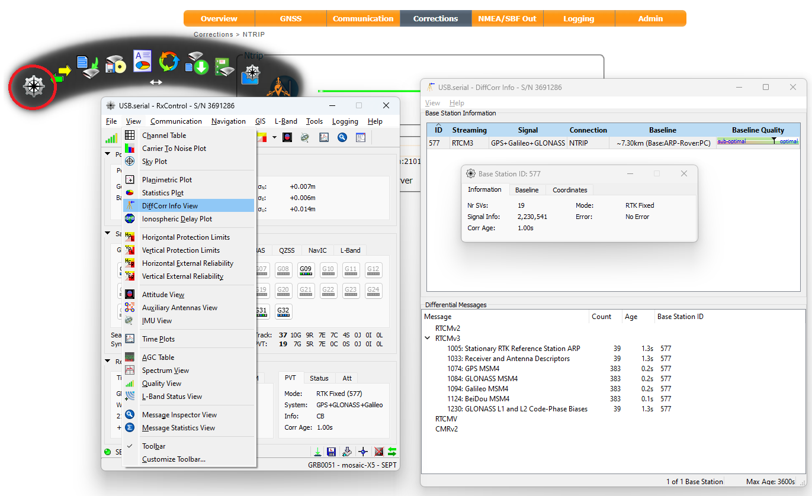

In Real Time Kinematic (RTK) positioning, a Rover uses corrections from a local Base station to accurately augment its position to centimeter level. This is done by using carrier-phase measurements of the received GNSS signals and differencing techniques. Put simply, an RTK Base knows where it is and - based on its location - can share satellite signal correction data with local Rovers, to allow them to achieve centimeter-level positioning.

NTRIP (Networked Transport of RTCM via Internet Protocol) is a standardized way of transferring RTCM correction data between RTK Bases and Rovers. It is the protocol used by NTRIP Casters for inbound and outbound corrections.

In this section, we are going to configure the mosaic-X5 as a Rover and have it use data from a commercial Correction Service which pools data from many base stations and provides you with corrections for your location.

To begin, check that the mosaic-X5 is configured as a **Rover**:

<figure markdown>
[{ width="400" }](./assets/img/hookup_guide/NTRIP_client_0.png "Click to enlarge")
<figcaption markdown>
[Rover Mode (PNG)](./assets/img/hookup_guide/NTRIP_client_0.png).
</figcaption>
</figure>

We've had good experiences with [PointOneNav](https://app.pointonenav.com/trial?src=sparkfun) where you get a 14 day free trial without needing to give them your credit card details. Enter your details in the **Create your account** window, create an account and verify your email address. A Trial Device is created automatically. Make a note of the Caster address, Mount Point, Username and Password. You will need to enter those into the mosaic-X5 NTRIP Client configuration. We suggest bookmarking the link to the [login page](https://app.pointonenav.com/login). If you are in Europe, the NTRIP Caster server is different. Please check the [Polaris NTRIP API documentation](https://pointonenav.github.io/docs/pages/ntrip.html) for details. PointOneNav supports TLS encryption too. Again, please check the [documentation](https://pointonenav.github.io/docs/pages/ntrip.html) for details.

<figure markdown>
[{ width="400" }](./assets/img/hookup_guide/PointOne_1.png "Click to enlarge")
<figcaption markdown>
[Point One Trial Device (PNG)](./assets/img/hookup_guide/PointOne_1.png).
</figcaption>
</figure>

In the **Corrections** tab, select **New NTRIP client**:

<figure markdown>
[{ width="400" }](./assets/img/hookup_guide/NTRIP_client_1.png "Click to enlarge")
<figcaption markdown>
[Configuring the NTRIP client (PNG)](./assets/img/hookup_guide/NTRIP_client_1.png).
</figcaption>
</figure>

Enter the details of your PointOneNav Trial Device. The **Mount point** pull-down is populated after you enter the **Caster** and **Port**.

<figure markdown>
[{ width="400" }](./assets/img/hookup_guide/NTRIP_client_2.png "Click to enlarge")
<figcaption markdown>
[Configuring the NTRIP client (PNG)](./assets/img/hookup_guide/NTRIP_client_2.png).
</figcaption>
</figure>

Remember to press **OK** after each change - and save the configuration.

Once the mosaic-X5 is connected to the correction service, you should get **RTK Fixed** almost instantly. It really is as simple as that. Here at SparkFun, we are able to get ~7mm accuracy using PointOneNav.

<figure markdown>
[{ width="400" }](./assets/img/hookup_guide/NTRIP_client_3.png "Click to enlarge")
<figcaption markdown>
[Position Accuracy (PNG)](./assets/img/hookup_guide/NTRIP_client_3.png).
</figcaption>
</figure>

The NTRIP connection is two-way. The mosaic-X5 is sending its approximate position to the Correction Service so that the Correction Service can send us the best data for our location. Another thing we like about PointOneNav is that they display your location in the web dashboard. This is a very handy, simple way of seeing where your Rover devices are.

<figure markdown>
[{ width="400" }](./assets/img/hookup_guide/NTRIP_client_4.png "Click to enlarge")
<figcaption markdown>
[Point One Nav Device Location (PNG)](./assets/img/hookup_guide/NTRIP_client_4.png).
</figcaption>
</figure>

If we want to, we can find out where our correction data is coming from. 7mm is pretty darn good, so the Base must be quite close? It turns out it is just 7.3km north of our location. Open **RxTools** \ **RxControl** and connect to the mosaic-X5; USB is ideal or you can connect over your network using IP. Open the **View** \ **DiffCorr Info View** (Differential Correction Information View) and a window is displayed showing which RTCM stations we are connected to and the baseline distance(s). Double-click on the Station ID and another window pops up where the information and coordinates of the station can be seen.

<figure markdown>
[{ width="400" }](./assets/img/hookup_guide/NTRIP_client_5.png "Click to enlarge")
<figcaption markdown>
[RTCM Station Information (PNG)](./assets/img/hookup_guide/NTRIP_client_5.png).
</figcaption>
</figure>
