The RTK mosaic-X5 is inspired by the [Septentrio mowi (mosaic wireless) open-source design](https://github.com/septentrio-gnss/mowi). The SparkFun design builds upon mowi, adding: separate Ethernet ports with mag jacks and Power-over-Ethernet; robust I/O headers with screw cage connections and configurable I/O voltage (3.3V or 5V); microSD data storage; and an OLED display.

We have intentionally kept the ESP32 firmware as simple as possible - supporting only two modes: Ethernet (mode **1**) and WiFi (mode **2**). The intention being that you can easily develop your own firmware for the RTK mosaic-X5 using the Espressif ESP IDF if the SparkFun firmware does not meet your needs.

You can of course modify the hardware too, should you want to. The design is completely open-source.

In this section we walk you through the hardware design, interfaces, I/O connections, power options and more.

## Schematic
Users can download the [full schematic for the RTK mosaic-X5](./assets/board_files/schematic.pdf) in .pdf format.

## Board Dimensions
The board dimensions are illustrated in the drawing below; the listed measurements are in inches.

<figure markdown>
[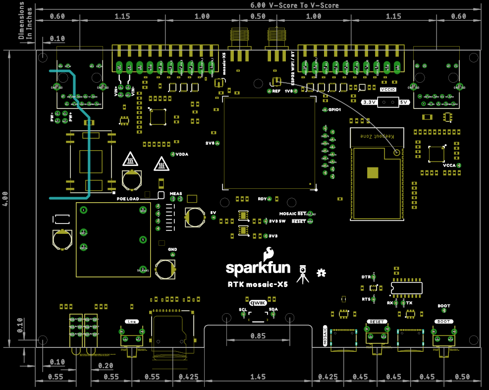{ width="400" }](./assets/board_files/dimensions.png "Click to enlarge")
<figcaption markdown>
[Board dimensions (PNG)](./assets/board_files/dimensions.png) for the RTK mosaic-X5 PCB, in inches.
</figcaption>
</figure>

??? tip "Need more measurements?"
	For more information about the board's dimensions, users can download the [**Eagle files**](./assets/board_files/eagle_files.zip) for the board. These files can be opened in Eagle and additional measurements can be made with the dimensions tool.

	??? info ":octicons-download-16:{ .heart } Eagle - Free Download!"
		Eagle is a [CAD]("computer-aided design") program for electronics that is free to use for hobbyists and students. However, it does require an account registration to utilize the software.

		

		[Download from :autodesk-primary:{ .autodesk }](https://www.autodesk.com/products/eagle/free-download "Go to downloads page"){ .md-button .md-button--primary width="250px" }
		

	
	??? info ":straight_ruler: Dimensions Tool"
		This video from Autodesk demonstrates how to utilize the dimensions tool in Eagle, to include additional measurements:

		

		

		<iframe src="https://www.youtube.com/embed/dZLNd1FtNB8" title="EAGLE Dimension Tool" frameborder="0" allow="accelerometer; autoplay; clipboard-write; encrypted-media; gyroscope; picture-in-picture" allowfullscreen></iframe>
		

## Septentrio mosaic-X5
The heart of our product is of course the mosaic-X5 GNSS module from Septentrio. It is a _very_ sophisticated chip with multiple interfaces: UARTS, USB and Ethernet. The COM2 and COM3 UART pins, plus GPIO1 and GPIO2, are available as 0.1" test points should you need access to them.

<figure markdown>
[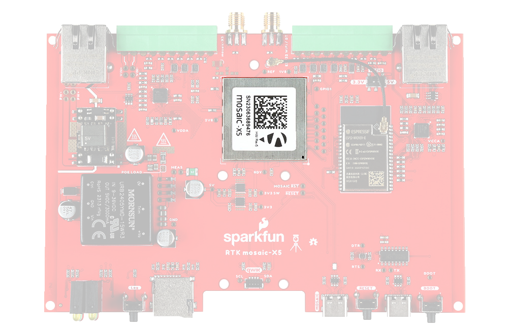{ width="400" }](./assets/img/hookup_guide/X5.png "Click to enlarge")
<figcaption markdown>The Septentrio mosaic-X5 GNSS module.</figcaption>
</figure>

## Espressif ESP32-WROVER
The only interface the mosaic-X5 doesn't offer is WiFi and that's why we've included an Espressif ESP32-WROVER processor (16MB flash, 8MB PSRAM) with its own Ethernet connection. You can connect the mosaic-X5 directly to your Ethernet network - our product supports Power-over-Ethernet too. Or you can link the mosaic-X5 Ethernet port to the ESP32 Ethernet port and have the ESP32 provide WiFi connectivity. In that mode, the ESP32 becomes an Ethernet to WiFi Bridge, seamlessly passing WiFi traffic to and from the mosaic-X5 via Ethernet.

<figure markdown>
[{ width="400" }](./assets/img/hookup_guide/ESP32.png "Click to enlarge")
<figcaption markdown>The Espressif ESP32-WROVER processor.</figcaption>
</figure>

Think of the ESP32 as a co-processor, or riding shotgun... The mosaic-X5 COM4 UART is linked to the ESP32, allowing the two to communicate directly without needing the Ethernet link. In our firmware, the ESP32 requests NMEA GGA data over this link and then displays it on the I2C OLED display.

## Ethernet PHY Interfaces and Connections
The mosaic-X5 and ESP32 have identical KSZ8041NLI Ethernet PHY interfaces, both connected using Reduced Media-Independent Interfaces (RMII). These allow the mosaic-X5 and ESP32 to be linked directly to your Ethernet network or router, or to each other when the ESP32 is acting as an Ethernet-to-WiFi Bridge.

<figure markdown>
[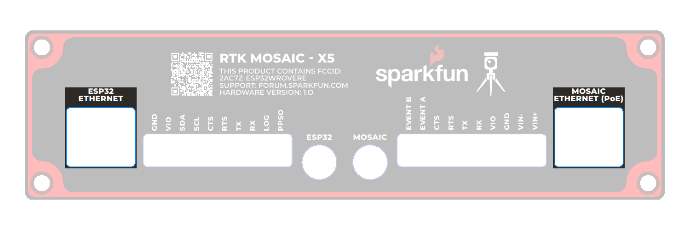{ width="400" }](./assets/img/hookup_guide/PHY.png "Click to enlarge")
<figcaption markdown>The dual Ethernet physical layer interfaces and connections.</figcaption>
</figure>

## Power-over-Ethernet (PoE)
The mosaic-X5 Ethernet port supports Power-over-Ethernet (PoE), allowing the RTK mosaic-X5 to be powered by the network. This is very useful when the RTK mosaic-X5 is mounted remotely - perhaps in a weatherproof box up on the roof. Data and power can be delivered through a single cable, avoiding the need for a separate power connection.

<figure markdown>
[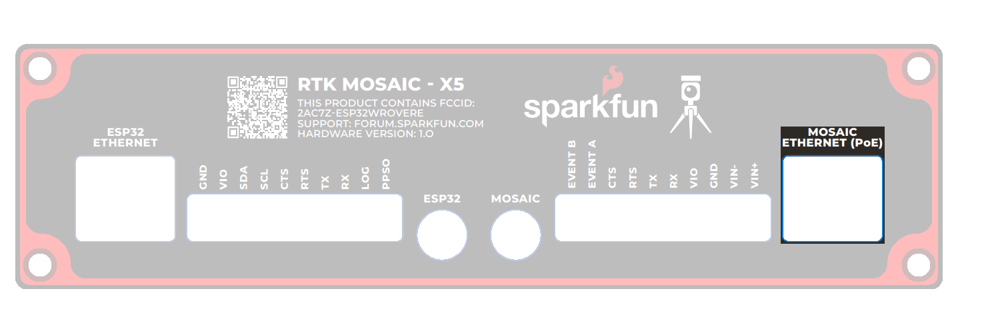{ width="400" }](./assets/img/hookup_guide/POE.png "Click to enlarge")
<figcaption markdown>The Power-over-Ethernet (PoE) circuit.</figcaption>
</figure>

## External DC Power (VIN)
The RTK mosaic-X5 includes a fully-isolated DC-DC converter, for applications where you may want to power the unit from a vehicle. The DC-DC converter accepts DC voltages between 9V and 36V, regulating this down to 5V. The converter is fully isolated to 1.5kV and operates with ~90% efficiency.

For 12V or 24V vehicle power: connect 12V or 24V to the **VIN+** screw cage terminal; connect 0V (chassis) to the **VIN-** screw cage terminal.

If desired, you can link **VIN-** to the adjacent **GND** screw cage terminal. But doing so bypasses the voltage isolation and could introduce an unwanted ground loop, particularly if the GNSS antenna ground (shield, 0V) is also connected to the chassis.

<figure markdown>
[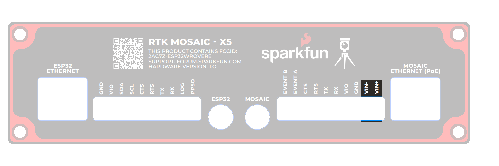{ width="400" }](./assets/img/hookup_guide/VIN.png "Click to enlarge")
<figcaption markdown>The DC-DC converter and external power screw terminals.</figcaption>
</figure>

## USB-C Connectors
The mosaic-X5 and ESP32 both have USB-C connections. The MOSAIC USB port is high-speed and connected to the X5 through a balancing transformer. The ESP32 USB port is connected through a CH340 USB-UART IC.

The RTK mosaic-X5 can draw power from either or both USB ports, in addition to Power-over-Ethernet and the DC-DC external input described above.

<figure markdown>
[{ width="400" }](./assets/img/hookup_guide/USB.png "Click to enlarge")
<figcaption markdown>USB-C connectors: mosaic-X5 (left) and ESP32 (right).</figcaption>
</figure>

The CH340 allows the ESP32-WROVER to communicate with a computer/host device through the USB-C connection. This allows the ESP32 to show up as a device on the serial (or COM) port of the computer. Users will need to install the latest drivers for the computer to recognize the CH340 *(see [**Quick Start**](./quick_start.md#WiFi) section)*.

## Power Options
The mosaic-X5 and the ESP32 both required 3.3V power. To simplify the power circuitry, the four power sources are combined into a common 5V rail which then feeds individual 3.3V 1A regulators for the mosaic-X5 and the ESP32. Diodes are used to combine and protect the power sources from each other.

If you want to measure the board's current draw, you can open the **MEAS** jumper and measure the current via a pair of breakout pads *(see the **[Jumpers](#jumpers)** section)*.

A 2A resettable fuse (green) provides additional protection.

<figure markdown>
[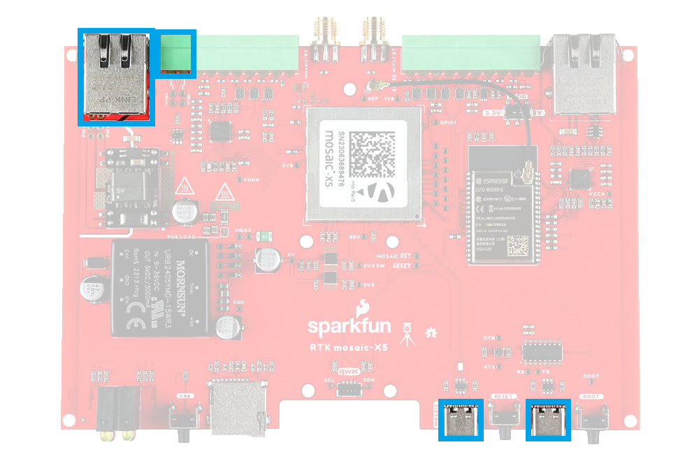{ width="400" }](./assets/img/hookup_guide/Power.png "Click to enlarge")
<figcaption markdown>RTK mosaic-X5 power connections.</figcaption>
</figure>

The RTK mosaic-X5 can draw power from any or all of:

* **`MOSAIC CONFIG (USB-C)`** - **5V**.
* **`ESP32 CONFIG (USB-C)`** - **5V**.
* **`Power-over-Ethernet`** - **Min: 36V**; **Max: 57V**; delivered via the **MOSAIC ETHERNET** RJ45 magjack.
* **`External DC Power`** - **Min: 9V**; **Max: 36V**; delivered via the **VIN+** and **VIN-** screw cage terminals.

!!! info
	For more details, users can reference the [schematic](./assets/board_files/schematic.pdf) and the datasheets of the individual components on the board.

## microSD storage and Log button
The microSD socket is connected directly to the mosaic-X5 via a one-bit SDIO interface for fast data logging. The mosaic-X5 supports FAT32 cards up to 32GB in size.

<figure markdown>
[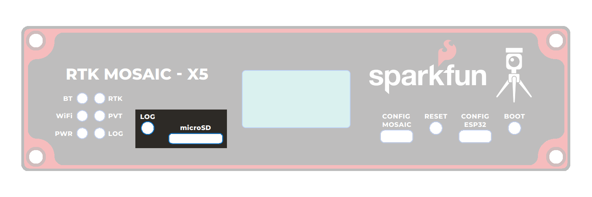{ width="400" }](./assets/img/hookup_guide/Log.png "Click to enlarge")
<figcaption markdown>microSD socket and Log button.</figcaption>
</figure>

Before logging can take place, it is necessary to define a "logging stream" using the **Logging** page or **RxTools**. Streams can contain NMEA or SBF (Septentrio Binary Format) data; SBF can contain RTCM and/or RINEX.

Once the stream is defined, a short press of the Log button will start or stop logging. The red Log LED will flash while logging is taking place.

A long press (> 5 seconds) on the Log button will dismount or mount the SD card. 

<figure markdown>
[{ width="400" }](./assets/img/hookup_guide/Logging.png "Click to enlarge")
<figcaption markdown>microSD logging stream configuration.</figcaption>
</figure>

:material-youtube: [How to log data to the SD card of the Septentrio mosaic receiver module](https://youtu.be/Y9tvOebnoxk)

## SMA RF Connections
The RTK mosaic-X5 has robust SMA connectors for the mosaic-X5 GNSS antenna and the ESP32 WiFi / BT antenna.

<figure markdown>
[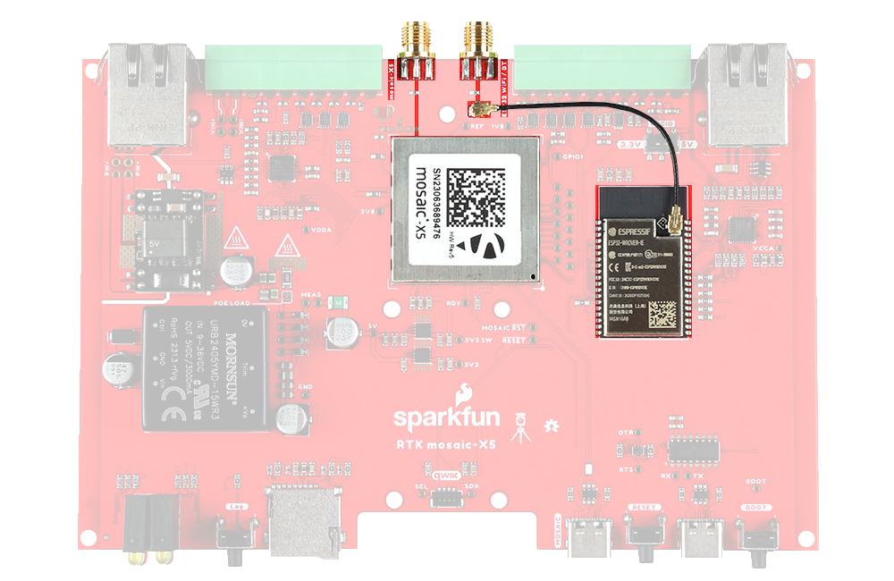{ width="400" }](./assets/img/hookup_guide/RF.png "Click to enlarge")
<figcaption markdown>SMA RF Connections.</figcaption>
</figure>

The mosaic-X5 SMA connector is standard polarity and provides 5V power for an active antenna.

The ESP32 WiFi / BT SMA connector is reverse-polarity (RP). A short u.FL cable connects the SMA connector to the ESP32-WROVER itself.

## I/O Terminals
The RTK moasic-X5 is equipped with two 10-way 3.5mm screw cage terminal connectors.

<figure markdown>
[{ width="400" }](./assets/img/hookup_guide/IO.png "Click to enlarge")
<figcaption markdown>I/O Screw Terminal Connections.</figcaption>
</figure>

These terminals are described in the tabs below. For more information on the I/O terminals, you can refer to the [schematic](./assets/board_files/schematic.pdf).

=== "External Power"
	The **VIN+** and **VIN-** terminals allow the RTK mosaic-X5 to be powered by an external DC power source - typically a 12V / 24V vehicle battery.

	

	| **Terminal** | **Function** |
	| :----------------- | :------------: |
	| **VIN+**   | External voltage: **Min: 9V**; **Max: 36V** |
	| **VIN-**   | Ground / Chassis / 0V |
	
	

	!!! tip
		The DC-DC converter in the RTK mosaic-X5 provides 1.5kV isolation between **VIN+**/**VIN-** and **5V**/**GND**. There is no direct electrical connection between **VIN-** and **GND**. If desired, you can link **VIN-** to the adjacent **GND** screw cage terminal. But doing so bypasses the voltage isolation and could introduce an unwanted ground loop, particularly if the GNSS antenna shield (0V) is also connected to the chassis.

=== "VIO & GND"
	The I/O terminal voltage can be set to 3.3V or 5V via the small internal slide switch highlighted below:

	<figure markdown>
	[{ width="400" }](./assets/img/hookup_guide/VCCIO.png "Click to enlarge")
	<figcaption markdown>I/O voltage selection switch.</figcaption>
	</figure>

	The **VIO** terminals can be used as power outputs or logic-high references. Likewise the **GND** terminals can be used for power return or as logic-low references.

	

	| **Terminal** | **Function** |
	| :----------------- | :------------: |
	| **VIO**   | 3.3V or 5V power output or logic-high reference |
	| **GND**   | Ground / 0V or logic-low reference |
	
	

	!!! tip
		The **VIO** and **GND** pins could be used to power (e.g.) a LoRa module. We recommend limiting the current draw from **VIO** to 200mA, and never drawing more than 500mA peak. The upstream 3.3V regulator is rated at 1A but it also provides power for the ESP32 processor.
	
=== "mosaic-X5 COM1"
	The mosaic-X5 UART COM1 connections are adjacent to the **EVENTA** and **EVENTB** terminals and are connected as follows:

	

	| **Terminal** | **Function** | **Notes** |
	| :----------------- | :------------: | :------------: |
	| **RX**   | COM1 UART Receive : **Input** | |
	| **TX**   | COM1 UART Transmit : **Output** | |
	| **RTS**  | COM1 UART Request To Send : **Output** | The module drives this pin low when ready to receive data |
	| **CTS**  | COM1 UART Clear To Send : **Input** | Must be driven low when ready to receive data from the module |
	
	

	!!! tip
		The COM1 I/O voltage is set by the I/O voltage selection switch.

	!!! tip
		The **CTS** input floats low. Pull CTS up to VIO to disable UART Transmit.

=== "EVENT A & B"
	The mosaic-X5 **EVENTA** and **EVENTB** inputs can be used to mark or timestamp external events:

	

	| **Terminal** | **Function** |
	| :----------------- | :------------: |
	| **EVENTA**   | Event A : Input |
	| **EVENTB**   | Event B : Input |
	
	

	!!! tip
		The EVENT voltage level is set by the I/O voltage selection switch.

	!!! tip
		The EVENT inputs are pulled low internally. Pull up to VIO to trigger an event.

	!!! tip
		An easy way to observe the events is with **RxTools** \ **RxControl** \ **Expert Console** (under **Tools**) \ **ExEvent** tab:

		<figure markdown>
		[{ width="400" }](./assets/img/hookup_guide/EVENT.png "Click to enlarge")
		<figcaption markdown>Capturing external events from EVENTA and EVENTB.</figcaption>
		</figure>

=== "PPSO"
	The mosaic-X5 **PPSO** is a configurable Pulse-Per-Second output. By default, PPSO is high for 5ms at 1Hz. The polarity, frequency and pulse width can be adjusted with the **setPPSParameters** command.

	

	| **Terminal** | **Function** |
	| :----------------- | :------------: |
	| **PPSO**   | Pulse-Per-Second : Output |
	
	

	!!! tip
		The PPSO voltage is set by the I/O voltage selection switch.

=== "LOG"
	The mosaic-X5 **LOG** input starts and stops microSD logging. It is also used to mount and dismount the microSD card.

	

	| **Terminal** | **Function** |
	| :----------------- | :------------: |
	| **LOG**   | Log : Input |
	
	

	!!! tip
		The LOG voltage level is set by the I/O voltage selection switch.

	!!! tip
		The LOG input is pulled up to VIO internally. Pull low to GND to start / stop logging.

	!!! tip
		Internal resistors allow the LOG I/O terminal and Log button to be used simultaneously. It is OK to press the Log button while the LOG terminal is being driven high (VIO).

=== "ESP32 UART"
	Four ESP32 GPIO pins are connected to I/O screw terminals as follows. These pins are not used by version 1.0.0 of the RTK mosaic-X5 ESP32 firmware. They are available for you to use if you are developing your own firmware.

	

	| **Terminal** | **Suggested Function** | **Notes** |
	| :----------------- | :------------: | :------------: |
	| **RX**   | UART Receive | **Input** - connected to GPIO pin 34 through a level-shifter |
	| **TX**   | UART Transmit | **Output** - connected to GPIO pin 32 through a level-shifter |
	| **RTS**  | UART Request To Send | **Output** - connected to GPIO pin 33 through a level-shifter |
	| **CTS**  | UART Clear To Send | **Input** - connected to GPIO pin 35 through a level-shifter |
	
	

	!!! tip
		The I/O voltage is set by the I/O voltage selection switch.

	!!! info
		These pins are not used by version 1.0.0 of the ESP32 firmware.

=== "SDA & SCL"
	The ESP32 I2C (`Wire`) bus **SDA** and **SCL** signals are available via the I/O terminals. Internally, the I2C bus is used to configure the Qwiic OLED display. If you connect a logic analyzer to the SDA and SCL I/O terminals, you will be able to see the OLED traffic (address 0x3D). We made the SDA and SCL signals accessible in case you are developing your own firmware for the RTK mosaic-X5. The I/O terminals are fully level-shifted. It is OK to have a 5V I2C peripheral connected while also using the internal 3.3V Qwiic bus for the OLED.

	| **Terminal** | **Function** |
	| :----------------- | :------------: |
	| **SDA**   | I2C Data |
	| **SCL**   | I2C Clock |
	
	!!! tip
		The I/O voltage is set by the I/O voltage selection switch.

	??? tip "What is Qwiic?"

		<!-- Qwiic Banner -->
		

		[{ width=400 }](https://www.sparkfun.com/qwiic)
		[{ width=400 }](https://www.sparkfun.com/qwiic)
		

		
		---
		
		The [Qwiic connect system](https://www.sparkfun.com/qwiic) is a solderless, polarized connection system that allows users to seamlessly daisy chain I2C boards together. Play the video below to learn more about the Qwiic connect system or click on the banner above to learn more about [Qwiic products](https://www.sparkfun.com/qwiic).
		
		
		

		

		<iframe src="https://www.youtube.com/embed/x0RDEHqFIF8" title="SparkFun's Qwiic Connect System" frameborder="0" allow="accelerometer; encrypted-media; gyroscope; picture-in-picture" allowfullscreen></iframe>
		

		

		!!! info "Features of the Qwiic System"

			=== "No Soldering"

				{ align="left" width="90" }
				{ align="left" width="90" }

				Qwiic cables (4-pin JST) plug easily from development boards to sensors, shields, accessory boards and more, making easy work of setting up a new prototype.

			=== "Polarized Connector"
		
				{ align="left" width="90" }
				{ align="left" width="90" }

				There's no need to worry about accidentally swapping the SDA and SCL wires on your breadboard. The Qwiic connector is polarized so you know you’ll have it wired correctly 	every time, right from the start.

				The PCB connector is part number SM04B-SRSS ([Datasheet](https://cdn.sparkfun.com/assets/parts/1/2/2/8/9/Qwiic_Connector_Datasheet.pdf)) or equivalent. The mating connector used on cables is part number SHR04V-S-B or an equivalent *(1mm pitch, 4-pin JST connector)*.
		
			=== "Daisy Chain-able"

				{ align="left" width="90" }
				{ align="left" width="90" }
		
				It’s time to leverage the power of the I2C bus! Most Qwiic boards will have two or more connectors on them, allowing multiple devices to be connected.

## Status LEDs

There are six status LEDs on the RTK mosaic-X5:

* `PWR` - Power *(Red)*
	* Iluminates when power is applied
* `LOG` - microSD Logging *(Red)*
	* Solid Red : microSD card is mounted
	* Blinking Red : data is being logged
	* Off : microSD is dismounted or not present
* `WiFi` - WiFi *(Green)*
	* The ESP32 firmware is using WiFi
	* Connected to ESP32 GPIO pin 12
* `PVT` - Position Velocity Time *(Green)*
	* Solid Green : the mosaic-X5 has valid Position, Velocity and Time
	* Off : satellite signal not present or acquired
* `BT` - BT *(Yellow)*
	* The ESP32 firmware is using BT
	* Connected to ESP32 GPIO pin 13
	* *Not used by firmware v1.0.0*
* `RTK` - Real-Time Kinematic *(Yellow)*
	* Solid Yellow : the mosaic-X5 has a RTK Fixed solution
	* Blinking Yellow: the mosaic-X5 has a RTK Float solution
	* Off : no RTK solution

<figure markdown>
[{ width="400" }](./assets/img/hookup_guide/LEDs.png "Click to enlarge")
<figcaption markdown>
The status indicator LEDs on the RTK mosaic-X5.
</figcaption>
</figure>

<figure markdown>
[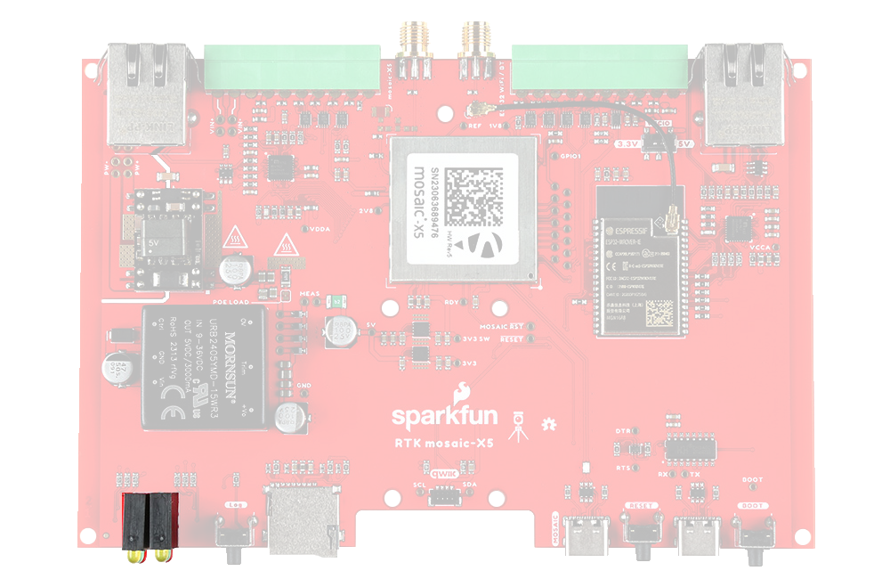{ width="400" }](./assets/img/hookup_guide/LEDs-PCB.png "Click to enlarge")
<figcaption markdown>
The status indicator LEDs on the RTK mosaic-X5 PCB.
</figcaption>
</figure>

## OLED Display
The RTK mosaic-X5 has a 128x64 pixel OLED display, controlled by the ESP32 via I2C. After some initial diagnostic messages, the display will show position, time and other data from the mosaic-X5 NMEA **GGA** message, plus the Ethernet / WiFi IP address.

* **Time:** - Universal Time Coordinate (UTC) in HHMMSS.SS format
	* Note: the display is updated approximately every 2 seconds. The time shown may not be precise.
* **Lat:** - Latitude in DDMM.MMMMMMM N/S format (this is the format used by the GGA message)
* **Long:** - Longitude in DDDMM.MMMMMMM E/W format (this is the format used by the GGA message)
* **Fix:** - the GNSS fix type
* **Sat:** - the number of satellites used in the navigation solution
	* Note: this is not the same as "Satellites In View"
* **HDOP:** - Horizontal Dilution Of Precision
	* Note: this is a dimensionless number indicating the horizontal position accuracy
* **Alt:** - the Altitude in metres
	* Note: this is altitude above Mean Sea Level, not Geoid
* **IP:** - the mosaic-X5 IP address, obtained via Ethernet or WiFi
	* The X5's internal configuration page can be viewed at this address

## Buttons
There are three buttons on the RTK mosaic-X5: ++"RST"++, ++"BOOT"++, and ++"LOG"++.

<figure markdown>
[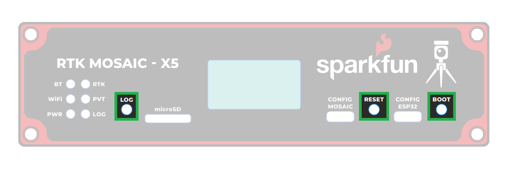{ width="400" }](./assets/img/hookup_guide/Buttons.png "Click to enlarge")
<figcaption markdown>Buttons on the RTK mosaic-X5.</figcaption>
</figure>

<figure markdown>
[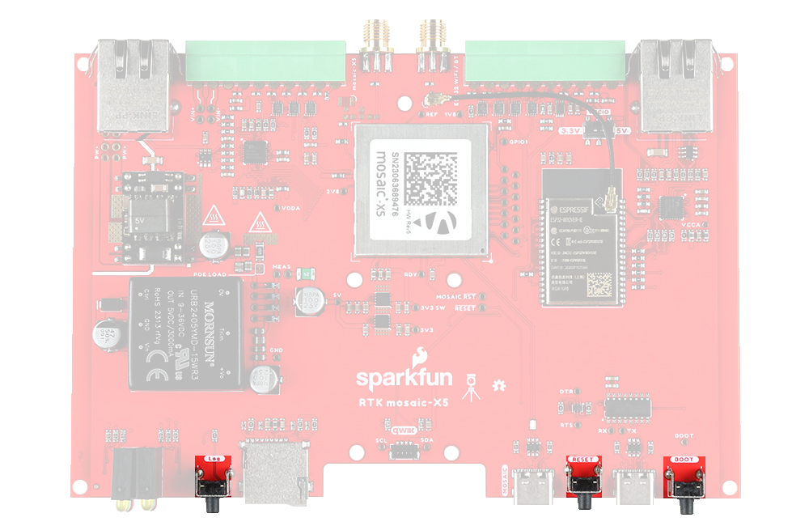{ width="400" }](./assets/img/hookup_guide/Buttons-PCB.png "Click to enlarge")
<figcaption markdown>Buttons on the RTK mosaic-X5 PCB.</figcaption>
</figure>

### Reset Button
The ++"RST"++ *(reset)* button allows users to reset the firmware running on the ESP32-WROVER module without disconnectng the power.

### Boot Control
The ++"BOOT"++ button can be used to force the ESP32 into the serial bootloader. Holding down the ++"BOOT"++ button, while connecting the RTK mosaic-X5 to a computer through its USB-C connector or resetting the board will cause it to enter the <a href="https://docs.espressif.com/projects/esptool/en/latest/esp32/advanced-topics/boot-mode-selection.html#manual-bootloader">Firmware Download mode</a>. The ESP32 will remain in this mode until it power cycles (happens automatically after uploading new firmware) or the ++"RST"++ button is pressed.

1. Hold the ++"BOOT"++ button down.
2. Reset the MCU.
	* While unpowered, connect the board to a computer with through the USB-C connection.
	* While powered, press the ++"RST"++ button.
3. Release the ++"BOOT"++ button.
4. After programming is completed, reboot the MCU.
	* Press the ++"RST"++ button.
	* Power cycle the board.

!!! info "BOOT and GPIO0"
	The ESP32 GPIO pin 0 is connected to the BOOT button. But is also used by the firmware to generate the 50MHz clock for the RMII Ethernet PHY interface.

	Pressing the BOOT button while the firmware is running in mode 2 (WiFi) will interrupt the clock and cause Ethernet communication with the mosaic-X5 to fail.

### Log Button
Once a [logging stream](#microsd-storage-and-log-button) is defined, a short press of the ++"Log"++ button will start or stop logging. The red Log LED will flash while logging is taking place.

A long press (> 5 seconds) on the ++"Log"++ button will dismount or mount the SD card. 

## Jumpers

??? note "Never modified a jumper before?"
	Check out our <a href="https://learn.sparkfun.com/tutorials/664">Jumper Pads and PCB Traces tutorial</a> for a quick introduction!

	

	-   <a href="https://learn.sparkfun.com/tutorials/664">
		<figure markdown>
		
		</figure>

		---
		
		**How to Work with Jumper Pads and PCB Traces**</a>

	

There are several jumpers on the RTK moasic-X5 PCB which can be used to (e.g.) disable the LEDs or allow measurement of the board's current draw.

<figure markdown>
[{ width="400" }](./assets/img/hookup_guide/Jumpers-top.png "Click to enlarge")
<figcaption markdown>
The jumpers on the top of the RTK mosaic-X5 PCB.
</figcaption>
</figure>

* **POE LOAD** - This jumper can be used to disconnect the Power-over-Ethernet (PoE) module 50 Ohm load.
	* The PoE module has a minimum load of 100mA. We included the 50 Ohm load to ensure this is met. If you can ensure this by other means, open this jumper to disconnect the load.

<figure markdown>
[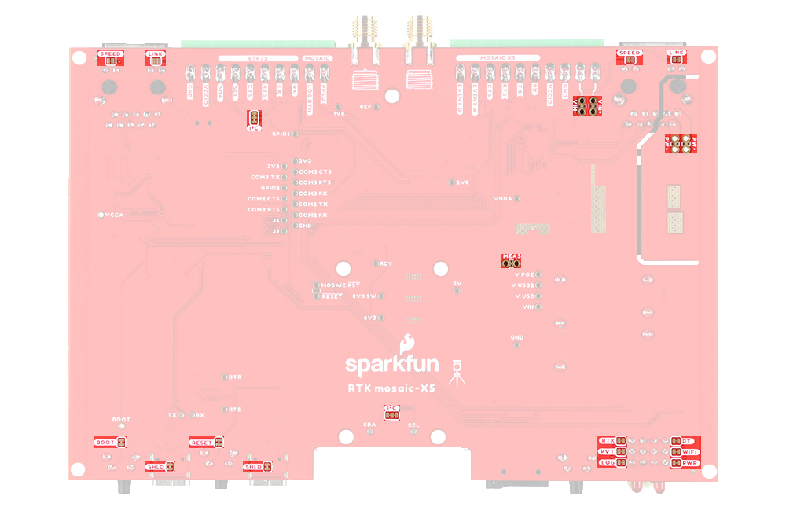{ width="400" }](./assets/img/hookup_guide/Jumpers-bottom.png "Click to enlarge")
<figcaption markdown>
The jumpers on the bottom of the RTK mosaic-X5 PCB.
</figcaption>
</figure>

* LED Jumpers
	* **LINK** (x2) - open these jumpers to disable the Ethernet Link LEDs.
	* **SPEED** (x2) - open these jumpers to disable the Ethernet Speed LEDs.
	* **RTK** - open this jumper to disable the mosaic-X5 Real-Time Kinetic LED.
	* **PVT** - open this jumper to disable the mosaic-X5 Position Velocity Time LED.
	* **LOG** - open this jumper to disable the mosaic-X5 Log LED.
	* **BT** - open this jumper to disable the ESP32 BT LED.
	* **WiFi** - open this jumper to disable the ESP32 WiFi LED.
	* **PWR** - open this jumper to disable the Power LED.
* Button Jumpers
	* **BOOT** - open this jumper to disconnect the ESP32 BOOT pushbutton.
	* **RESET** - open this jumper to disconnect the ESP32 RESET pushbutton.
* **SHLD** (x2) - open these jumpers to isolate the USB-C connector shield from GND.
* **I2C** - open this dual jumper to disconnect the pull-ups for the SDA and SCL I/O terminals.
	* Note: the internal 3.3V Qwiic bus has its own pull-ups which are disconnected by default. These can be enabled by closing the dual jumper under the OLED Qwiic connector. We suggest you only do this if you are disconnecting the OLED.
* **VIN+** and **VIN-**
	* Open these jumpers if you wish to isolate (disconnect) the external DC power terminals. The breakout pads can then be used to feed in power from an alternate source.
* **PW+** and **PW-**
	* Open these jumpers if you wish to isolate (disconnect) the Power-over-Ethernet pins on the MOSAIC Ethernet magjack. The breakout pads can then be used to feed in power from an alternate source.
* **MEAS**
	* Open the **MEAS** jumper if you wish to measure the total current drawn by the RTK mosaic-X5, or (e.g.) wish to add an ON/OFF switch. The breakout pads can then be used to attach a multimeter or a mechanical power switch.
	* **MEAS** is _upstream_ of the two 3.3V regulators, _downstream_ of the four power source combination and protection diodes.
